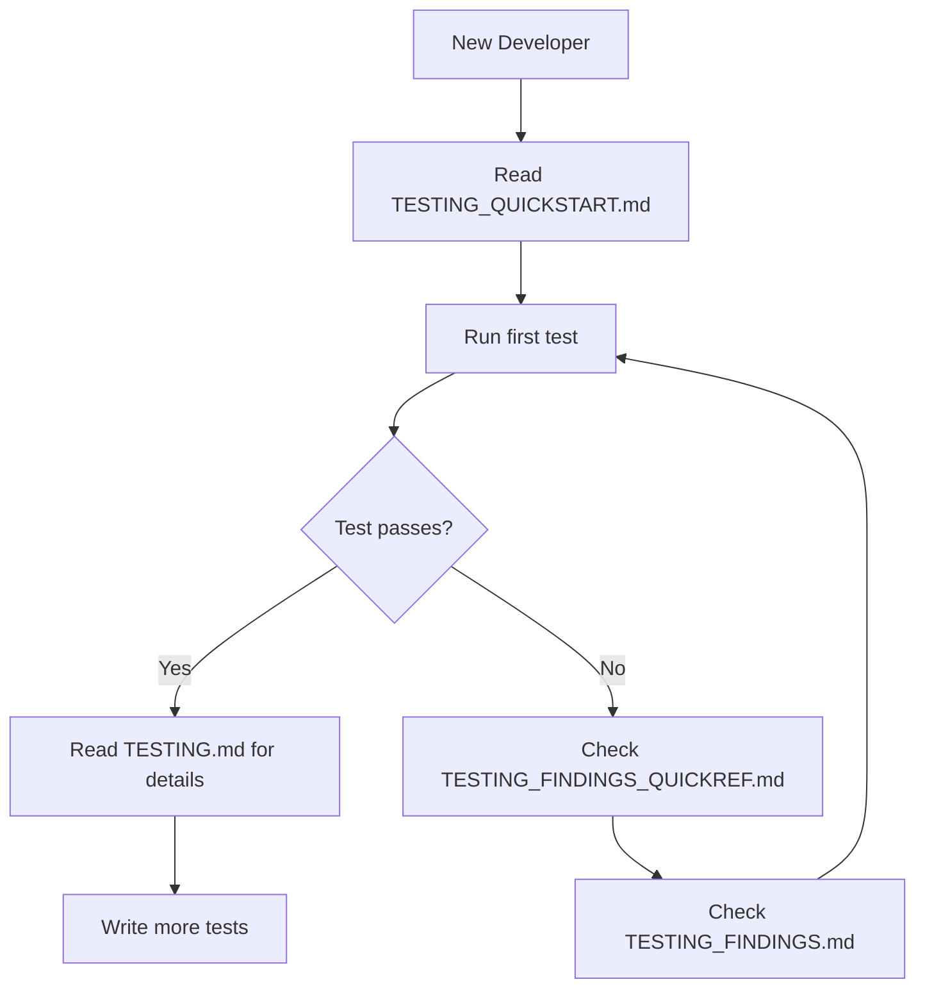
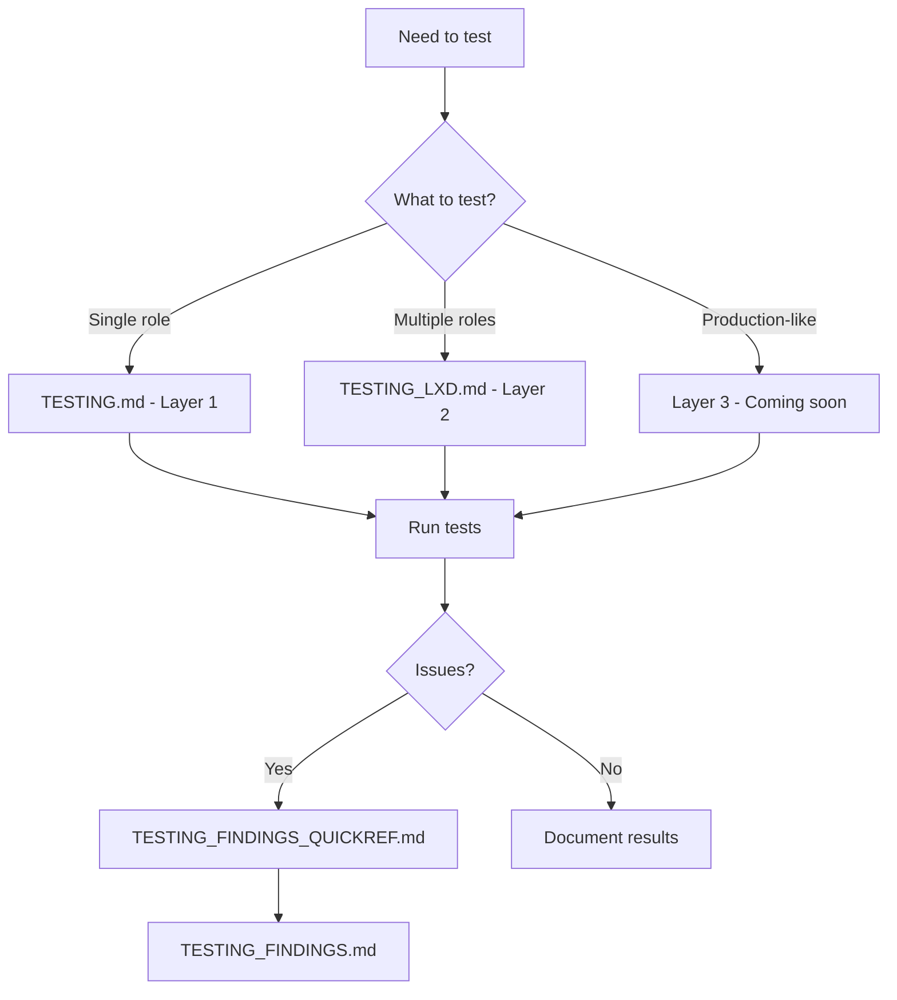

# Testing Documentation Index

This document provides a quick overview of all testing-related documentation in the ansible-pack repository.

**Last Updated**: 2026-01-02

---

## 📚 Document Overview

### Quick Start & Guides

| Document | Purpose | When to Use |
|----------|---------|-------------|
| [TESTING_QUICKSTART.md](TESTING_QUICKSTART.md) | 5-minute quick start for Layer 1 testing | Getting started, first-time setup |
| [TESTING.md](TESTING.md) | Comprehensive Layer 1 (Molecule) guide | Deep dive into unit testing |
| [TESTING_LXD.md](TESTING_LXD.md) | Complete Layer 2 (LXD) guide | Integration testing setup and usage |
| [TESTING_SUMMARY.md](TESTING_SUMMARY.md) | Overall testing strategy (all 3 layers) | Understanding the full approach |

### Results & Findings

| Document | Purpose | When to Use |
|----------|---------|-------------|
| [TESTING_FINDINGS.md](TESTING_FINDINGS.md) | Detailed findings from LXD testing | Understanding issues and solutions |
| [TESTING_FINDINGS_QUICKREF.md](TESTING_FINDINGS_QUICKREF.md) | Quick reference card for critical issues | Quick lookup during debugging |

### Repository Files

| Location | Purpose |
|----------|---------|
| `tests/lxd/README.md` | LXD test structure documentation |
| `tests/lxd/scenarios/` | Test playbooks for different scenarios |
| `tests/lxd/scripts/` | Helper scripts for LXD testing |
| `roles/*/molecule/` | Molecule test configurations per role |
| `Makefile` | Quick testing commands |

---

## 🎯 Quick Navigation by Use Case

### "I want to start testing immediately"
→ Start here: [TESTING_QUICKSTART.md](TESTING_QUICKSTART.md)

### "I need to test a single role"
→ Use: [TESTING.md](TESTING.md) - Layer 1 (Molecule)
```bash
make test-role ROLE=zsh
```

### "I need to test multiple roles together"
→ Use: [TESTING_LXD.md](TESTING_LXD.md) - Layer 2 (LXD)
```bash
make lxd-test-workstation
```

### "I'm getting errors during testing"
→ Check: [TESTING_FINDINGS_QUICKREF.md](TESTING_FINDINGS_QUICKREF.md)
→ Then: [TESTING_FINDINGS.md](TESTING_FINDINGS.md) for details

### "I want to understand the overall strategy"
→ Read: [TESTING_SUMMARY.md](TESTING_SUMMARY.md)

### "I have network issues with LXD"
→ Check: [TESTING_LXD.md](TESTING_LXD.md) → Troubleshooting → Network Issues

### "I found a bug or issue"
→ Reference: [TESTING_FINDINGS.md](TESTING_FINDINGS.md) to see if it's known
→ Document: Add to findings if it's new

---

## 📊 Testing Layers Reference

### Layer 1: Molecule + Docker
- **Speed**: 2-3 minutes per role
- **Purpose**: Unit testing individual roles
- **Status**: ✅ Working (ZSH role tested)
- **Documentation**: [TESTING.md](TESTING.md)

### Layer 2: LXD
- **Speed**: 5-10 minutes per scenario
- **Purpose**: Integration testing (multiple roles)
- **Status**: ✅ Working (workstation scenario validated)
- **Documentation**: [TESTING_LXD.md](TESTING_LXD.md)

### Layer 3: Proxmox
- **Speed**: 15-30 minutes
- **Purpose**: Acceptance testing (production-like)
- **Status**: 📋 Planned
- **Documentation**: Coming soon

---

## 🔍 Document Details

### TESTING_QUICKSTART.md
**Size**: ~150 lines
**Reading Time**: 5 minutes
**Content**:
- Prerequisites checklist
- Installation steps
- First test run
- Common commands
- Troubleshooting basics

### TESTING.md
**Size**: ~450 lines
**Reading Time**: 15-20 minutes
**Content**:
- Complete Molecule setup
- Test structure explanation
- Writing custom tests
- Advanced scenarios
- CI/CD integration
- Comprehensive troubleshooting

### TESTING_LXD.md
**Size**: ~340 lines
**Reading Time**: 15 minutes
**Content**:
- LXD installation and setup
- Network configuration
- Test scenarios
- Helper scripts
- Advanced usage
- Best practices
- Troubleshooting (including network issues)

### TESTING_SUMMARY.md
**Size**: ~380 lines
**Reading Time**: 10-15 minutes
**Content**:
- Testing pyramid overview
- Layer comparison
- When to use each layer
- Best practices
- CI/CD strategy
- Metrics and goals

### TESTING_FINDINGS.md
**Size**: ~850 lines
**Reading Time**: 20-25 minutes
**Content**:
- All issues discovered during testing
- Root cause analysis
- Solutions applied
- Recommended fixes
- Role-specific findings
- Lessons learned
- Metrics and appendices

### TESTING_FINDINGS_QUICKREF.md
**Size**: ~120 lines
**Reading Time**: 3-5 minutes
**Content**:
- Critical issues only
- Quick fixes
- Verification commands
- Action items
- Related documents

---

## 📝 Document Status

| Document | Status | Last Updated |
|----------|--------|--------------|
| TESTING_QUICKSTART.md | ✅ Complete | 2026-01-02 |
| TESTING.md | ✅ Complete | 2026-01-02 |
| TESTING_LXD.md | ✅ Complete | 2026-01-02 |
| TESTING_SUMMARY.md | ✅ Complete | 2026-01-02 |
| TESTING_FINDINGS.md | ✅ Complete | 2026-01-02 |
| TESTING_FINDINGS_QUICKREF.md | ✅ Complete | 2026-01-02 |
| README.md (Testing section) | ✅ Updated | 2026-01-02 |

---

## 🔄 Documentation Workflow

### For Developers



### For Testers



---

## 💡 Key Points

### For First-Time Users
1. Start with [TESTING_QUICKSTART.md](TESTING_QUICKSTART.md)
2. Test one role with Layer 1
3. If successful, explore Layer 2
4. Reference findings docs when issues occur

### For Experienced Users
1. Use Layer 1 (Molecule) for role development
2. Use Layer 2 (LXD) before merging PRs
3. Reference [TESTING_FINDINGS.md](TESTING_FINDINGS.md) for known issues
4. Update documentation when finding new issues

### For Maintainers
1. Keep [TESTING_FINDINGS.md](TESTING_FINDINGS.md) updated with new issues
2. Document fixes and solutions
3. Update quick reference when critical issues found
4. Maintain testing metrics and goals

---

## 📞 Getting Help

### If tests fail:
1. Check [TESTING_FINDINGS_QUICKREF.md](TESTING_FINDINGS_QUICKREF.md)
2. Read relevant section in [TESTING_FINDINGS.md](TESTING_FINDINGS.md)
3. Check troubleshooting in layer-specific guide
4. Create issue with details

### If documentation unclear:
1. Note which document and section
2. Suggest improvements
3. Update documentation after resolution

### If new issue discovered:
1. Document in [TESTING_FINDINGS.md](TESTING_FINDINGS.md)
2. Add to quick reference if critical
3. Update troubleshooting sections
4. Share with team

---

## 🎓 Learning Path

### Beginner
1. [TESTING_QUICKSTART.md](TESTING_QUICKSTART.md) - Start here
2. Run first test
3. [TESTING_FINDINGS_QUICKREF.md](TESTING_FINDINGS_QUICKREF.md) - Bookmark for quick reference

### Intermediate
4. [TESTING.md](TESTING.md) - Learn Layer 1 in depth
5. [TESTING_LXD.md](TESTING_LXD.md) - Learn Layer 2
6. [TESTING_FINDINGS.md](TESTING_FINDINGS.md) - Understand common issues

### Advanced
7. [TESTING_SUMMARY.md](TESTING_SUMMARY.md) - Full strategy
8. Write custom tests
9. Contribute to testing infrastructure
10. Document new findings

---

## 📈 Metrics

### Documentation Coverage
- ✅ Layer 1 (Molecule): Complete
- ✅ Layer 2 (LXD): Complete
- 📋 Layer 3 (Proxmox): Planned

### Test Coverage
- ✅ Roles with Molecule tests: 1/6 (zsh)
- ✅ Integration scenarios: 2 (workstation, server)
- ✅ LXD validated: Yes
- 📋 Proxmox validated: Not yet

### Issues Documented
- Critical issues: 1 (hardcoded username)
- High priority: 3 (dependencies, network)
- Medium priority: 1 (interface name)
- Total documented: 5

---

## 🔗 External Resources

- [Molecule Documentation](https://molecule.readthedocs.io/)
- [LXD Documentation](https://linuxcontainers.org/lxd/)
- [Ansible Testing Strategies](https://www.ansible.com/blog/testing-ansible-roles-with-molecule)
- [Ansible Best Practices](https://docs.ansible.com/ansible/latest/user_guide/playbooks_best_practices.html)

---

**Maintained by**: Testing Team
**Repository**: ansible-pack
**Last Review**: 2026-01-02
